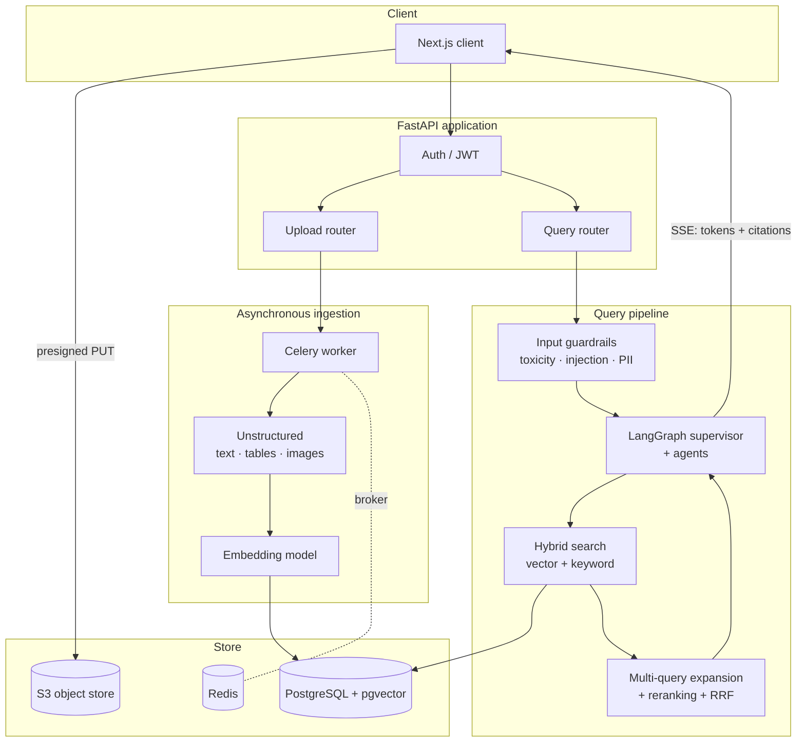

# Six Figure RAG — Server

A multi-modal Retrieval-Augmented Generation backend built with FastAPI. It ingests PDFs, Word and PowerPoint documents and web pages, extracts text, tables and images from them, and answers questions against that corpus with cited, grounded responses streamed back to the client in real time.

**Live demo:** https://six-figure-rag-client.vercel.app  
**Client repo:** https://github.com/VishnuGanapathy/six-figure-rag-client

---

## Why this exists

Most RAG demos stop at "chunk a PDF, embed it, do a cosine search." That falls over on real documents, which contain tables and diagrams, and on real questions, which need more than a single nearest-neighbour lookup. This project addresses both: multi-modal extraction on the ingestion side, and hybrid retrieval with reranking and multi-agent orchestration on the query side. It can also run entirely against a local LLM, so organisations can process proprietary documents without sending anything to an external API.

---

## Architecture



**Ingestion.** The client requests a presigned S3 URL and uploads the file directly to object storage, so large documents never occupy an API worker. The API enqueues a Celery task; the worker pulls the file, runs Unstructured to separate text, tables and images, embeds each element into 1536-dimensional vectors and writes them to PostgreSQL with pgvector. Progress is reported back so the UI can show ingestion state rather than a spinner.

**Retrieval.** Incoming questions pass three input guardrails (toxicity, prompt injection, PII) before reaching the pipeline. Retrieval combines dense vector search with keyword search, expands the query into multiple variants, reranks the merged candidates and fuses the rankings with Reciprocal Rank Fusion. Search strategy is configurable per project.

**Generation.** A LangGraph supervisor routes work across agents, tracks citations so every claim maps back to a source chunk, and streams tokens and citation events over Server-Sent Events.

---

## Stack

| Layer | Choice |
|---|---|
| API | FastAPI, Pydantic |
| Async work | Celery, Redis |
| Database | PostgreSQL, pgvector |
| Object storage | S3 (presigned uploads) |
| Orchestration | LangGraph, LangChain |
| Models | OpenAI API, or local via Ollama / Llama |
| Extraction | Unstructured |
| Auth | Clerk, JWT |
| Evaluation | RAGAS |

---

## Running it locally

**Prerequisites:** Python 3.11+, PostgreSQL 15+ with the `pgvector` extension, Redis, and an S3 bucket (or an S3-compatible store such as MinIO).

```bash
git clone https://github.com/VishnuGanapathy/six-figure-rag-server.git
cd six-figure-rag-server

python -m venv .venv
source .venv/bin/activate        # Windows: .venv\Scripts\activate
pip install -r requirements.txt

cp .env.example .env             # then fill in the values below
```

Enable the vector extension and apply the schema:

```bash
psql "$DATABASE_URL" -c "CREATE EXTENSION IF NOT EXISTS vector;"
alembic upgrade head
```

Run the API and the worker in two terminals:

```bash
uvicorn main:app --reload --port 8000
celery -A <worker_module> worker --loglevel=info
```

Interactive API docs are then at `http://localhost:8000/docs`.

### Environment variables

| Variable | Purpose |
|---|---|
| `DATABASE_URL` | PostgreSQL connection string |
| `REDIS_URL` | Celery broker and result backend |
| `OPENAI_API_KEY` | Embeddings and generation |
| `AWS_ACCESS_KEY_ID` / `AWS_SECRET_ACCESS_KEY` | S3 access |
| `AWS_REGION`, `S3_BUCKET` | Upload target |
| `CLERK_SECRET_KEY` | Token verification |
| `LOCAL_LLM_BASE_URL` | Ollama endpoint, when running without OpenAI |

Never commit `.env` — it is in `.gitignore`.

---

## Running against a local model

Set `LOCAL_LLM_BASE_URL` to a running Ollama instance and the pipeline routes generation there instead of to OpenAI. Nothing leaves the host, which is the point: sensitive corpora can be indexed and queried on-premises.

```bash
ollama serve
ollama pull llama3
```

---

## Evaluation

Retrieval and answer quality are measured with [RAGAS](https://docs.ragas.io) against a held-out question set (N = 30), comparing the full pipeline to a naive single-vector-search baseline. Hybrid retrieval with reranking and RRF measured roughly 30% higher retrieval accuracy than the baseline.

```bash
python -m evaluation.run        # writes results to evaluation/results/
```

---

## Roadmap

- [ ] Test suite over the retrieval pipeline and API routes
- [ ] Dockerfile and docker-compose for one-command local setup
- [ ] CI on pull requests
- [ ] Per-project retrieval configuration exposed through the API
- [ ] Output guardrails to complement the existing input guardrails

---

## Licence

MIT
